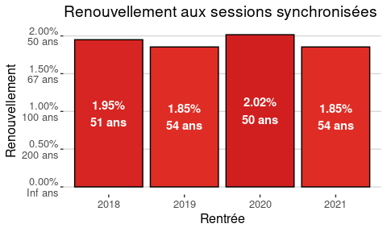
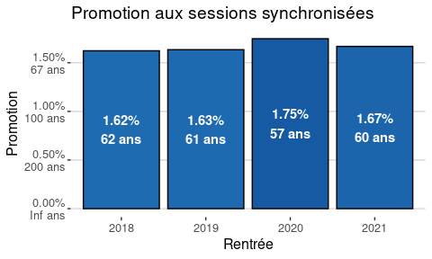

## Information globales

La campagne d'emplois synchronisée de recrutement des enseignants-chercheurs (EC) est la procédure principale de recrutement des EC titulaires. 

Les données sont les suivantes :

- [Galaxy](https://www.galaxie.enseignementsup-recherche.gouv.fr/ensup/ListesPostesPublies/Emplois_publies_TrieParCorps.html)
- [DataESR](https://data.enseignementsup-recherche.gouv.fr/explore/dataset/fr-esr-enseignants-titulaires-esr-public/information/) (seule la dernière année 2017-2018 est utilisée pour les effectifs de référence)

Des versions exploitables sont disponibles ici :

- [Campagne 2018](emplois-ec.2018.csv)
- [Campagne 2019](emplois-ec.2019.csv)
- [Campagne 2020](emplois-ec.2020.csv) (mise à jour le 26/02/2020 à 16h)
- [Campagne 2021](emplois-ec.2021.csv) (mise à jour le 25/02/2021 à 11h)
- [Campagnes 2018-2021](emplois-ec.csv)
- [Effectifs 2018-201-](effectifs-ec.csv)
- [Campagne CNU](emplois-ec.cnu.csv)
- [Campagne Etablissements](emplois-ec.2021.csv)

### Nombre d'emplois

Les enseignants-chercheurs titulaires sont divisés en deux corps :

- MCF : Maitres de conférences, qui représente le premier poste titulaire ;
- PR : Professeur des universités.

<!-- -->

### Renouvellement

Le renouvellement est défini comme le rapport entre le nombre d'emplois de Maîtres de conférences et les effectifs d'enseignants-chercheurs :

<!-- $renouvellement = \frac{emplois \ MCF}{effectifs \ MCF + PR}$ -->
renouvellement = emplois_MCF / (effectifs_MCF + effectifs_PR)


Le renouvellement peut se lire en pourcents ou en année. Par exemple, un renouvellement de 0.05 peut se lire : « 5% des effectifs sont renouvelés » ou « Au rythme actuel, il faudra 20 ans pour renouveler les effectifs ».

_Attention_ : cette lecture suppose un effectif constant (hypothèse solide à l'heure actuelle). Si on considère une absence de départs (notamment à la retraite), la lecture devient « les effectifs seront augmenté de 5% » ou « Au rythme actuel, il faudra 20 ans pour doubler les effectifs ». La vérité est entre les deux.

<!-- -->

### Promotion

La promotion est définie comme le rapport entre le nombre d'emplois de Professeurs et les effectifs Maîtres de conférences :

<!-- $promotion = \frac{emplois \ PR}{effectifs \ MCF}$ -->
promotion = emplois_PR / effectifs_MCF

La promotion peut se lire en pourcents ou en année. Par exemple, une promotion de 0.05 peut se lire : « 5% des MCF vont obtenir une promotion PR » ou « Au rythme actuel, il faudra 20 ans pour promouvoir tous les MCF ».

<!-- -->


## Section CNU

_Attention_ : Ces résultats ne tiennent pas compte des 169 postes sur plusieurs sections. Seule la première est prise en compte.


### Nombre d'emplois


```
## `summarise()` regrouping output by 'Rentrée' (override with `.groups` argument)
```

<!-- -->


```
## `summarise()` regrouping output by 'Rentrée' (override with `.groups` argument)
```

<!-- -->


<!-- -->

### Renouvellement

_Attention_ : Les données 2018 et 2019 de la section 76 (Théologie Catholique) ont été filtrée pour améliorer la présentation des données (elle présente un renouvellement de 10% en 2018, mais sur un effectif non significatif)


```
## `summarise()` regrouping output by 'Rentrée' (override with `.groups` argument)
```

<!-- -->


```
## `summarise()` regrouping output by 'Rentrée' (override with `.groups` argument)
```

<!-- -->

<!-- -->


### Promotion


```
## `summarise()` regrouping output by 'Rentrée' (override with `.groups` argument)
```

<!-- -->


```
## `summarise()` regrouping output by 'Rentrée' (override with `.groups` argument)
```

<!-- -->

<!-- -->


### Tableau

<table class="table table-striped" style="margin-left: auto; margin-right: auto;">
 <thead>
  <tr>
   <th style="text-align:left;position: sticky; top:0; background-color: #FFFFFF;"> Section CNU </th>
   <th style="text-align:left;position: sticky; top:0; background-color: #FFFFFF;"> Emplois MCF </th>
   <th style="text-align:left;position: sticky; top:0; background-color: #FFFFFF;"> Emplois PR </th>
   <th style="text-align:left;position: sticky; top:0; background-color: #FFFFFF;"> Effectif MCF </th>
   <th style="text-align:right;position: sticky; top:0; background-color: #FFFFFF;"> Effectif PR </th>
   <th style="text-align:right;position: sticky; top:0; background-color: #FFFFFF;"> Renouvellement </th>
   <th style="text-align:right;position: sticky; top:0; background-color: #FFFFFF;"> Promotion </th>
  </tr>
 </thead>
<tbody>
  <tr>
   <td style="text-align:left;width: 1em; "> 1 </td>
   <td style="text-align:left;width: 1em; "> 1-Droit privé et sciences criminelles </td>
   <td style="text-align:left;width: 1em; "> Droit et science politique </td>
   <td style="text-align:left;width: 1em; "> Droit, économie et gestion </td>
   <td style="text-align:right;width: 1em; "> 53 </td>
   <td style="text-align:right;"> 30 </td>
   <td style="text-align:right;"> 1212 </td>
  </tr>
  <tr>
   <td style="text-align:left;width: 1em; "> 2 </td>
   <td style="text-align:left;width: 1em; "> 2-Droit public </td>
   <td style="text-align:left;width: 1em; "> Droit et science politique </td>
   <td style="text-align:left;width: 1em; "> Droit, économie et gestion </td>
   <td style="text-align:right;width: 1em; "> 40 </td>
   <td style="text-align:right;"> 15 </td>
   <td style="text-align:right;"> 794 </td>
  </tr>
  <tr>
   <td style="text-align:left;width: 1em; "> 3 </td>
   <td style="text-align:left;width: 1em; "> 3-Histoire du droit et des institutions </td>
   <td style="text-align:left;width: 1em; "> Droit et science politique </td>
   <td style="text-align:left;width: 1em; "> Droit, économie et gestion </td>
   <td style="text-align:right;width: 1em; "> 5 </td>
   <td style="text-align:right;"> 1 </td>
   <td style="text-align:right;"> 150 </td>
  </tr>
  <tr>
   <td style="text-align:left;width: 1em; "> 4 </td>
   <td style="text-align:left;width: 1em; "> 4-Science politique </td>
   <td style="text-align:left;width: 1em; "> Droit et science politique </td>
   <td style="text-align:left;width: 1em; "> Droit, économie et gestion </td>
   <td style="text-align:right;width: 1em; "> 15 </td>
   <td style="text-align:right;"> 5 </td>
   <td style="text-align:right;"> 265 </td>
  </tr>
  <tr>
   <td style="text-align:left;width: 1em; "> 5 </td>
   <td style="text-align:left;width: 1em; "> 5-Sciences économiques </td>
   <td style="text-align:left;width: 1em; "> Sciences économiques et de gestion </td>
   <td style="text-align:left;width: 1em; "> Droit, économie et gestion </td>
   <td style="text-align:right;width: 1em; "> 43 </td>
   <td style="text-align:right;"> 25 </td>
   <td style="text-align:right;"> 1168 </td>
  </tr>
  <tr>
   <td style="text-align:left;width: 1em; "> 6 </td>
   <td style="text-align:left;width: 1em; "> 6-Sciences de gestion et du management </td>
   <td style="text-align:left;width: 1em; "> Sciences économiques et de gestion </td>
   <td style="text-align:left;width: 1em; "> Droit, économie et gestion </td>
   <td style="text-align:right;width: 1em; "> 79 </td>
   <td style="text-align:right;"> 20 </td>
   <td style="text-align:right;"> 1620 </td>
  </tr>
  <tr>
   <td style="text-align:left;width: 1em; "> 7 </td>
   <td style="text-align:left;width: 1em; "> 7-Sciences du langage </td>
   <td style="text-align:left;width: 1em; "> Langues et littératures </td>
   <td style="text-align:left;width: 1em; "> Lettres et sciences humaines </td>
   <td style="text-align:right;width: 1em; "> 26 </td>
   <td style="text-align:right;"> 18 </td>
   <td style="text-align:right;"> 530 </td>
  </tr>
  <tr>
   <td style="text-align:left;width: 1em; "> 8 </td>
   <td style="text-align:left;width: 1em; "> 8-Langues et littératures anciennes </td>
   <td style="text-align:left;width: 1em; "> Langues et littératures </td>
   <td style="text-align:left;width: 1em; "> Lettres et sciences humaines </td>
   <td style="text-align:right;width: 1em; "> 7 </td>
   <td style="text-align:right;"> 4 </td>
   <td style="text-align:right;"> 185 </td>
  </tr>
  <tr>
   <td style="text-align:left;width: 1em; "> 9 </td>
   <td style="text-align:left;width: 1em; "> 9-Langue et littérature française </td>
   <td style="text-align:left;width: 1em; "> Langues et littératures </td>
   <td style="text-align:left;width: 1em; "> Lettres et sciences humaines </td>
   <td style="text-align:right;width: 1em; "> 24 </td>
   <td style="text-align:right;"> 27 </td>
   <td style="text-align:right;"> 594 </td>
  </tr>
  <tr>
   <td style="text-align:left;width: 1em; "> 10 </td>
   <td style="text-align:left;width: 1em; "> 10-Littératures comparées </td>
   <td style="text-align:left;width: 1em; "> Langues et littératures </td>
   <td style="text-align:left;width: 1em; "> Lettres et sciences humaines </td>
   <td style="text-align:right;width: 1em; "> 5 </td>
   <td style="text-align:right;"> 0 </td>
   <td style="text-align:right;"> 127 </td>
  </tr>
  <tr>
   <td style="text-align:left;width: 1em; "> 11 </td>
   <td style="text-align:left;width: 1em; "> 11-Etudes anglophones </td>
   <td style="text-align:left;width: 1em; "> Langues et littératures </td>
   <td style="text-align:left;width: 1em; "> Lettres et sciences humaines </td>
   <td style="text-align:right;width: 1em; "> 53 </td>
   <td style="text-align:right;"> 21 </td>
   <td style="text-align:right;"> 1248 </td>
  </tr>
  <tr>
   <td style="text-align:left;width: 1em; "> 12 </td>
   <td style="text-align:left;width: 1em; "> 12-Etudes germaniques et scandinaves </td>
   <td style="text-align:left;width: 1em; "> Langues et littératures </td>
   <td style="text-align:left;width: 1em; "> Lettres et sciences humaines </td>
   <td style="text-align:right;width: 1em; "> 6 </td>
   <td style="text-align:right;"> 2 </td>
   <td style="text-align:right;"> 286 </td>
  </tr>
  <tr>
   <td style="text-align:left;width: 1em; "> 13 </td>
   <td style="text-align:left;width: 1em; "> 13-Etudes slaves et baltes </td>
   <td style="text-align:left;width: 1em; "> Langues et littératures </td>
   <td style="text-align:left;width: 1em; "> Lettres et sciences humaines </td>
   <td style="text-align:right;width: 1em; "> 4 </td>
   <td style="text-align:right;"> 2 </td>
   <td style="text-align:right;"> 93 </td>
  </tr>
  <tr>
   <td style="text-align:left;width: 1em; "> 14 </td>
   <td style="text-align:left;width: 1em; "> 14-Etudes romanes </td>
   <td style="text-align:left;width: 1em; "> Langues et littératures </td>
   <td style="text-align:left;width: 1em; "> Lettres et sciences humaines </td>
   <td style="text-align:right;width: 1em; "> 18 </td>
   <td style="text-align:right;"> 13 </td>
   <td style="text-align:right;"> 727 </td>
  </tr>
  <tr>
   <td style="text-align:left;width: 1em; "> 15 </td>
   <td style="text-align:left;width: 1em; "> 15-Langues, littératures et cultures africaines, asiatiques et d'autres aires </td>
   <td style="text-align:left;width: 1em; "> Langues et littératures </td>
   <td style="text-align:left;width: 1em; "> Lettres et sciences humaines </td>
   <td style="text-align:right;width: 1em; "> 15 </td>
   <td style="text-align:right;"> 12 </td>
   <td style="text-align:right;"> 305 </td>
  </tr>
  <tr>
   <td style="text-align:left;width: 1em; "> 16 </td>
   <td style="text-align:left;width: 1em; "> 16-Psychologie et ergonomie </td>
   <td style="text-align:left;width: 1em; "> Sciences humaines </td>
   <td style="text-align:left;width: 1em; "> Lettres et sciences humaines </td>
   <td style="text-align:right;width: 1em; "> 46 </td>
   <td style="text-align:right;"> 18 </td>
   <td style="text-align:right;"> 964 </td>
  </tr>
  <tr>
   <td style="text-align:left;width: 1em; "> 17 </td>
   <td style="text-align:left;width: 1em; "> 17-Philosophie </td>
   <td style="text-align:left;width: 1em; "> Sciences humaines </td>
   <td style="text-align:left;width: 1em; "> Lettres et sciences humaines </td>
   <td style="text-align:right;width: 1em; "> 18 </td>
   <td style="text-align:right;"> 12 </td>
   <td style="text-align:right;"> 234 </td>
  </tr>
  <tr>
   <td style="text-align:left;width: 1em; "> 18 </td>
   <td style="text-align:left;width: 1em; "> 18-Architecture (ses théories et ses pratiques), arts appliqués, arts plastiques, arts du spectacle, épistémologie des enseignements artistiques, esthétique, musicologie, musique, sciences de l'art </td>
   <td style="text-align:left;width: 1em; "> Sciences humaines </td>
   <td style="text-align:left;width: 1em; "> Lettres et sciences humaines </td>
   <td style="text-align:right;width: 1em; "> 29 </td>
   <td style="text-align:right;"> 12 </td>
   <td style="text-align:right;"> 527 </td>
  </tr>
  <tr>
   <td style="text-align:left;width: 1em; "> 19 </td>
   <td style="text-align:left;width: 1em; "> 19-Sociologie, démographie </td>
   <td style="text-align:left;width: 1em; "> Sciences humaines </td>
   <td style="text-align:left;width: 1em; "> Lettres et sciences humaines </td>
   <td style="text-align:right;width: 1em; "> 26 </td>
   <td style="text-align:right;"> 14 </td>
   <td style="text-align:right;"> 633 </td>
  </tr>
  <tr>
   <td style="text-align:left;width: 1em; "> 20 </td>
   <td style="text-align:left;width: 1em; "> 20-Ethnologie, préhistoire, anthropologie biologique </td>
   <td style="text-align:left;width: 1em; "> Sciences humaines </td>
   <td style="text-align:left;width: 1em; "> Lettres et sciences humaines </td>
   <td style="text-align:right;width: 1em; "> 5 </td>
   <td style="text-align:right;"> 5 </td>
   <td style="text-align:right;"> 136 </td>
  </tr>
  <tr>
   <td style="text-align:left;width: 1em; "> 21 </td>
   <td style="text-align:left;width: 1em; "> 21-Histoire, civilisations, archéologie et art des mondes anciens et médiévaux </td>
   <td style="text-align:left;width: 1em; "> Sciences humaines </td>
   <td style="text-align:left;width: 1em; "> Lettres et sciences humaines </td>
   <td style="text-align:right;width: 1em; "> 14 </td>
   <td style="text-align:right;"> 13 </td>
   <td style="text-align:right;"> 479 </td>
  </tr>
  <tr>
   <td style="text-align:left;width: 1em; "> 22 </td>
   <td style="text-align:left;width: 1em; "> 22-Histoire et civilisations : histoire des mondes modernes, histoire du monde contemporain , de l'art , de la musique </td>
   <td style="text-align:left;width: 1em; "> Sciences humaines </td>
   <td style="text-align:left;width: 1em; "> Lettres et sciences humaines </td>
   <td style="text-align:right;width: 1em; "> 32 </td>
   <td style="text-align:right;"> 21 </td>
   <td style="text-align:right;"> 669 </td>
  </tr>
  <tr>
   <td style="text-align:left;width: 1em; "> 23 </td>
   <td style="text-align:left;width: 1em; "> 23-Géographie physique, humaine, économique et régionale </td>
   <td style="text-align:left;width: 1em; "> Sciences humaines </td>
   <td style="text-align:left;width: 1em; "> Lettres et sciences humaines </td>
   <td style="text-align:right;width: 1em; "> 24 </td>
   <td style="text-align:right;"> 12 </td>
   <td style="text-align:right;"> 595 </td>
  </tr>
  <tr>
   <td style="text-align:left;width: 1em; "> 24 </td>
   <td style="text-align:left;width: 1em; "> 24-Aménagement de l'espace, urbanisme </td>
   <td style="text-align:left;width: 1em; "> Sciences humaines </td>
   <td style="text-align:left;width: 1em; "> Lettres et sciences humaines </td>
   <td style="text-align:right;width: 1em; "> 2 </td>
   <td style="text-align:right;"> 2 </td>
   <td style="text-align:right;"> 163 </td>
  </tr>
  <tr>
   <td style="text-align:left;width: 1em; "> 25 </td>
   <td style="text-align:left;width: 1em; "> 25-Mathématiques </td>
   <td style="text-align:left;width: 1em; "> Mathématiques et informatique </td>
   <td style="text-align:left;width: 1em; "> Sciences </td>
   <td style="text-align:right;width: 1em; "> 25 </td>
   <td style="text-align:right;"> 9 </td>
   <td style="text-align:right;"> 796 </td>
  </tr>
  <tr>
   <td style="text-align:left;width: 1em; "> 26 </td>
   <td style="text-align:left;width: 1em; "> 26-Mathématiques appliquées et applications des mathématiques </td>
   <td style="text-align:left;width: 1em; "> Mathématiques et informatique </td>
   <td style="text-align:left;width: 1em; "> Sciences </td>
   <td style="text-align:right;width: 1em; "> 41 </td>
   <td style="text-align:right;"> 20 </td>
   <td style="text-align:right;"> 1144 </td>
  </tr>
  <tr>
   <td style="text-align:left;width: 1em; "> 27 </td>
   <td style="text-align:left;width: 1em; "> 27-Informatique </td>
   <td style="text-align:left;width: 1em; "> Mathématiques et informatique </td>
   <td style="text-align:left;width: 1em; "> Sciences </td>
   <td style="text-align:right;width: 1em; "> 71 </td>
   <td style="text-align:right;"> 41 </td>
   <td style="text-align:right;"> 2372 </td>
  </tr>
  <tr>
   <td style="text-align:left;width: 1em; "> 28 </td>
   <td style="text-align:left;width: 1em; "> 28-Milieux denses et matériaux </td>
   <td style="text-align:left;width: 1em; "> Physique </td>
   <td style="text-align:left;width: 1em; "> Sciences </td>
   <td style="text-align:right;width: 1em; "> 15 </td>
   <td style="text-align:right;"> 19 </td>
   <td style="text-align:right;"> 849 </td>
  </tr>
  <tr>
   <td style="text-align:left;width: 1em; "> 29 </td>
   <td style="text-align:left;width: 1em; "> 29-Constituants élémentaires </td>
   <td style="text-align:left;width: 1em; "> Physique </td>
   <td style="text-align:left;width: 1em; "> Sciences </td>
   <td style="text-align:right;width: 1em; "> 4 </td>
   <td style="text-align:right;"> 6 </td>
   <td style="text-align:right;"> 221 </td>
  </tr>
  <tr>
   <td style="text-align:left;width: 1em; "> 30 </td>
   <td style="text-align:left;width: 1em; "> 30-Milieux dilués et optique </td>
   <td style="text-align:left;width: 1em; "> Physique </td>
   <td style="text-align:left;width: 1em; "> Sciences </td>
   <td style="text-align:right;width: 1em; "> 3 </td>
   <td style="text-align:right;"> 3 </td>
   <td style="text-align:right;"> 371 </td>
  </tr>
  <tr>
   <td style="text-align:left;width: 1em; "> 31 </td>
   <td style="text-align:left;width: 1em; "> 31-Chimie théorique, physique, analytique </td>
   <td style="text-align:left;width: 1em; "> Chimie </td>
   <td style="text-align:left;width: 1em; "> Sciences </td>
   <td style="text-align:right;width: 1em; "> 12 </td>
   <td style="text-align:right;"> 13 </td>
   <td style="text-align:right;"> 663 </td>
  </tr>
  <tr>
   <td style="text-align:left;width: 1em; "> 32 </td>
   <td style="text-align:left;width: 1em; "> 32-Chimie organique, minérale, industrielle </td>
   <td style="text-align:left;width: 1em; "> Chimie </td>
   <td style="text-align:left;width: 1em; "> Sciences </td>
   <td style="text-align:right;width: 1em; "> 9 </td>
   <td style="text-align:right;"> 5 </td>
   <td style="text-align:right;"> 832 </td>
  </tr>
  <tr>
   <td style="text-align:left;width: 1em; "> 33 </td>
   <td style="text-align:left;width: 1em; "> 33-Chimie des matériaux </td>
   <td style="text-align:left;width: 1em; "> Chimie </td>
   <td style="text-align:left;width: 1em; "> Sciences </td>
   <td style="text-align:right;width: 1em; "> 10 </td>
   <td style="text-align:right;"> 6 </td>
   <td style="text-align:right;"> 577 </td>
  </tr>
  <tr>
   <td style="text-align:left;width: 1em; "> 34 </td>
   <td style="text-align:left;width: 1em; "> 34-Astronomie, astrophysique </td>
   <td style="text-align:left;width: 1em; "> Sciences de la terre </td>
   <td style="text-align:left;width: 1em; "> Sciences </td>
   <td style="text-align:right;width: 1em; "> 0 </td>
   <td style="text-align:right;"> 1 </td>
   <td style="text-align:right;"> 113 </td>
  </tr>
  <tr>
   <td style="text-align:left;width: 1em; "> 35 </td>
   <td style="text-align:left;width: 1em; "> 35-Structure et évolution de la terre et des autres planètes </td>
   <td style="text-align:left;width: 1em; "> Sciences de la terre </td>
   <td style="text-align:left;width: 1em; "> Sciences </td>
   <td style="text-align:right;width: 1em; "> 18 </td>
   <td style="text-align:right;"> 7 </td>
   <td style="text-align:right;"> 326 </td>
  </tr>
  <tr>
   <td style="text-align:left;width: 1em; "> 36 </td>
   <td style="text-align:left;width: 1em; "> 36-Terre solide : géodynamique des enveloppes supérieure, paléo-biosphère </td>
   <td style="text-align:left;width: 1em; "> Sciences de la terre </td>
   <td style="text-align:left;width: 1em; "> Sciences </td>
   <td style="text-align:right;width: 1em; "> 4 </td>
   <td style="text-align:right;"> 4 </td>
   <td style="text-align:right;"> 266 </td>
  </tr>
  <tr>
   <td style="text-align:left;width: 1em; "> 37 </td>
   <td style="text-align:left;width: 1em; "> 37-Météorologie, océanographie physique et physique de l'environnement </td>
   <td style="text-align:left;width: 1em; "> Sciences de la terre </td>
   <td style="text-align:left;width: 1em; "> Sciences </td>
   <td style="text-align:right;width: 1em; "> 1 </td>
   <td style="text-align:right;"> 6 </td>
   <td style="text-align:right;"> 132 </td>
  </tr>
  <tr>
   <td style="text-align:left;width: 1em; "> 60 </td>
   <td style="text-align:left;width: 1em; "> 60-Mécanique, génie mécanique, génie civil </td>
   <td style="text-align:left;width: 1em; "> Mécanique, génie informatique, énergétique, génie électrique </td>
   <td style="text-align:left;width: 1em; "> Sciences </td>
   <td style="text-align:right;width: 1em; "> 39 </td>
   <td style="text-align:right;"> 33 </td>
   <td style="text-align:right;"> 1611 </td>
  </tr>
  <tr>
   <td style="text-align:left;width: 1em; "> 61 </td>
   <td style="text-align:left;width: 1em; "> 61-Génie informatique, automatique et traitement du signal </td>
   <td style="text-align:left;width: 1em; "> Mécanique, génie informatique, énergétique, génie électrique </td>
   <td style="text-align:left;width: 1em; "> Sciences </td>
   <td style="text-align:right;width: 1em; "> 33 </td>
   <td style="text-align:right;"> 16 </td>
   <td style="text-align:right;"> 1208 </td>
  </tr>
  <tr>
   <td style="text-align:left;width: 1em; "> 62 </td>
   <td style="text-align:left;width: 1em; "> 62-Energétique, génie des procédés </td>
   <td style="text-align:left;width: 1em; "> Mécanique, génie informatique, énergétique, génie électrique </td>
   <td style="text-align:left;width: 1em; "> Sciences </td>
   <td style="text-align:right;width: 1em; "> 15 </td>
   <td style="text-align:right;"> 12 </td>
   <td style="text-align:right;"> 698 </td>
  </tr>
  <tr>
   <td style="text-align:left;width: 1em; "> 63 </td>
   <td style="text-align:left;width: 1em; "> 63-Génie électrique, électronique, photonique et systèmes </td>
   <td style="text-align:left;width: 1em; "> Mécanique, génie informatique, énergétique, génie électrique </td>
   <td style="text-align:left;width: 1em; "> Sciences </td>
   <td style="text-align:right;width: 1em; "> 28 </td>
   <td style="text-align:right;"> 22 </td>
   <td style="text-align:right;"> 1110 </td>
  </tr>
  <tr>
   <td style="text-align:left;width: 1em; "> 64 </td>
   <td style="text-align:left;width: 1em; "> 64-Biochimie et biologie moléculaire </td>
   <td style="text-align:left;width: 1em; "> Biologie et biochimie, neurosciences </td>
   <td style="text-align:left;width: 1em; "> Sciences </td>
   <td style="text-align:right;width: 1em; "> 24 </td>
   <td style="text-align:right;"> 13 </td>
   <td style="text-align:right;"> 774 </td>
  </tr>
  <tr>
   <td style="text-align:left;width: 1em; "> 65 </td>
   <td style="text-align:left;width: 1em; "> 65-Biologie cellulaire </td>
   <td style="text-align:left;width: 1em; "> Biologie et biochimie, neurosciences </td>
   <td style="text-align:left;width: 1em; "> Sciences </td>
   <td style="text-align:right;width: 1em; "> 21 </td>
   <td style="text-align:right;"> 10 </td>
   <td style="text-align:right;"> 752 </td>
  </tr>
  <tr>
   <td style="text-align:left;width: 1em; "> 66 </td>
   <td style="text-align:left;width: 1em; "> 66-Physiologie </td>
   <td style="text-align:left;width: 1em; "> Biologie et biochimie, neurosciences </td>
   <td style="text-align:left;width: 1em; "> Sciences </td>
   <td style="text-align:right;width: 1em; "> 6 </td>
   <td style="text-align:right;"> 2 </td>
   <td style="text-align:right;"> 548 </td>
  </tr>
  <tr>
   <td style="text-align:left;width: 1em; "> 67 </td>
   <td style="text-align:left;width: 1em; "> 67-Biologie des populations et écologie </td>
   <td style="text-align:left;width: 1em; "> Biologie et biochimie, neurosciences </td>
   <td style="text-align:left;width: 1em; "> Sciences </td>
   <td style="text-align:right;width: 1em; "> 12 </td>
   <td style="text-align:right;"> 4 </td>
   <td style="text-align:right;"> 501 </td>
  </tr>
  <tr>
   <td style="text-align:left;width: 1em; "> 68 </td>
   <td style="text-align:left;width: 1em; "> 68-Biologie des organismes </td>
   <td style="text-align:left;width: 1em; "> Biologie et biochimie, neurosciences </td>
   <td style="text-align:left;width: 1em; "> Sciences </td>
   <td style="text-align:right;width: 1em; "> 1 </td>
   <td style="text-align:right;"> 4 </td>
   <td style="text-align:right;"> 343 </td>
  </tr>
  <tr>
   <td style="text-align:left;width: 1em; "> 69 </td>
   <td style="text-align:left;width: 1em; "> 69-Neurosciences </td>
   <td style="text-align:left;width: 1em; "> Biologie et biochimie, neurosciences </td>
   <td style="text-align:left;width: 1em; "> Sciences </td>
   <td style="text-align:right;width: 1em; "> 4 </td>
   <td style="text-align:right;"> 3 </td>
   <td style="text-align:right;"> 281 </td>
  </tr>
  <tr>
   <td style="text-align:left;width: 1em; "> 70 </td>
   <td style="text-align:left;width: 1em; "> 70-Sciences de l'éducation et de la formation </td>
   <td style="text-align:left;width: 1em; "> Pluridisciplinaire </td>
   <td style="text-align:left;width: 1em; "> Lettres et sciences humaines </td>
   <td style="text-align:right;width: 1em; "> 30 </td>
   <td style="text-align:right;"> 17 </td>
   <td style="text-align:right;"> 505 </td>
  </tr>
  <tr>
   <td style="text-align:left;width: 1em; "> 71 </td>
   <td style="text-align:left;width: 1em; "> 71-Sciences de l'information et de la communication </td>
   <td style="text-align:left;width: 1em; "> Pluridisciplinaire </td>
   <td style="text-align:left;width: 1em; "> Lettres et sciences humaines </td>
   <td style="text-align:right;width: 1em; "> 28 </td>
   <td style="text-align:right;"> 9 </td>
   <td style="text-align:right;"> 619 </td>
  </tr>
  <tr>
   <td style="text-align:left;width: 1em; "> 72 </td>
   <td style="text-align:left;width: 1em; "> 72-Epistémologie, histoire des sciences et des techniques </td>
   <td style="text-align:left;width: 1em; "> Pluridisciplinaire </td>
   <td style="text-align:left;width: 1em; "> Lettres et sciences humaines </td>
   <td style="text-align:right;width: 1em; "> 2 </td>
   <td style="text-align:right;"> 1 </td>
   <td style="text-align:right;"> 69 </td>
  </tr>
  <tr>
   <td style="text-align:left;width: 1em; "> 73 </td>
   <td style="text-align:left;width: 1em; "> 73-Cultures et langues régionales </td>
   <td style="text-align:left;width: 1em; "> Pluridisciplinaire </td>
   <td style="text-align:left;width: 1em; "> Lettres et sciences humaines </td>
   <td style="text-align:right;width: 1em; "> 1 </td>
   <td style="text-align:right;"> 2 </td>
   <td style="text-align:right;"> 27 </td>
  </tr>
  <tr>
   <td style="text-align:left;width: 1em; "> 74 </td>
   <td style="text-align:left;width: 1em; "> 74-Sciences et techniques des activités physiques et sportives </td>
   <td style="text-align:left;width: 1em; "> Pluridisciplinaire </td>
   <td style="text-align:left;width: 1em; "> Lettres et sciences humaines </td>
   <td style="text-align:right;width: 1em; "> 40 </td>
   <td style="text-align:right;"> 13 </td>
   <td style="text-align:right;"> 648 </td>
  </tr>
  <tr>
   <td style="text-align:left;width: 1em; "> 85 </td>
   <td style="text-align:left;width: 1em; "> 85-Sciences physico-chimiques et ingénierie appliquée à la santé </td>
   <td style="text-align:left;width: 1em; "> Pharmacie(mono-appartenants) </td>
   <td style="text-align:left;width: 1em; "> Pharmacie </td>
   <td style="text-align:right;width: 1em; "> 3 </td>
   <td style="text-align:right;"> 4 </td>
   <td style="text-align:right;"> 322 </td>
  </tr>
  <tr>
   <td style="text-align:left;width: 1em; "> 86 </td>
   <td style="text-align:left;width: 1em; "> 86-Sciences du médicament et des autres produits de santé </td>
   <td style="text-align:left;width: 1em; "> Pharmacie(mono-appartenants) </td>
   <td style="text-align:left;width: 1em; "> Pharmacie </td>
   <td style="text-align:right;width: 1em; "> 17 </td>
   <td style="text-align:right;"> 4 </td>
   <td style="text-align:right;"> 381 </td>
  </tr>
  <tr>
   <td style="text-align:left;width: 1em; "> 87 </td>
   <td style="text-align:left;width: 1em; "> 87-Sciences biologiques, fondamentales et cliniques </td>
   <td style="text-align:left;width: 1em; "> Pharmacie(mono-appartenants) </td>
   <td style="text-align:left;width: 1em; "> Pharmacie </td>
   <td style="text-align:right;width: 1em; "> 11 </td>
   <td style="text-align:right;"> 6 </td>
   <td style="text-align:right;"> 296 </td>
  </tr>
</tbody>
</table>


